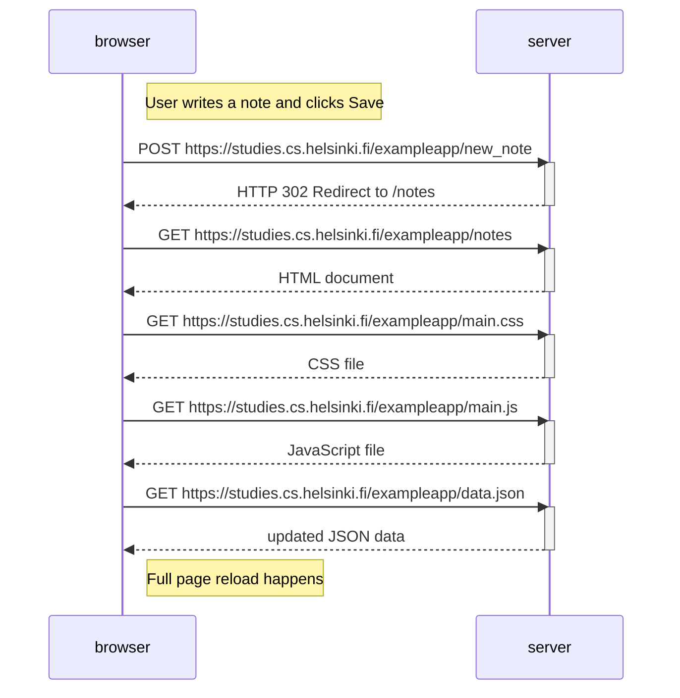
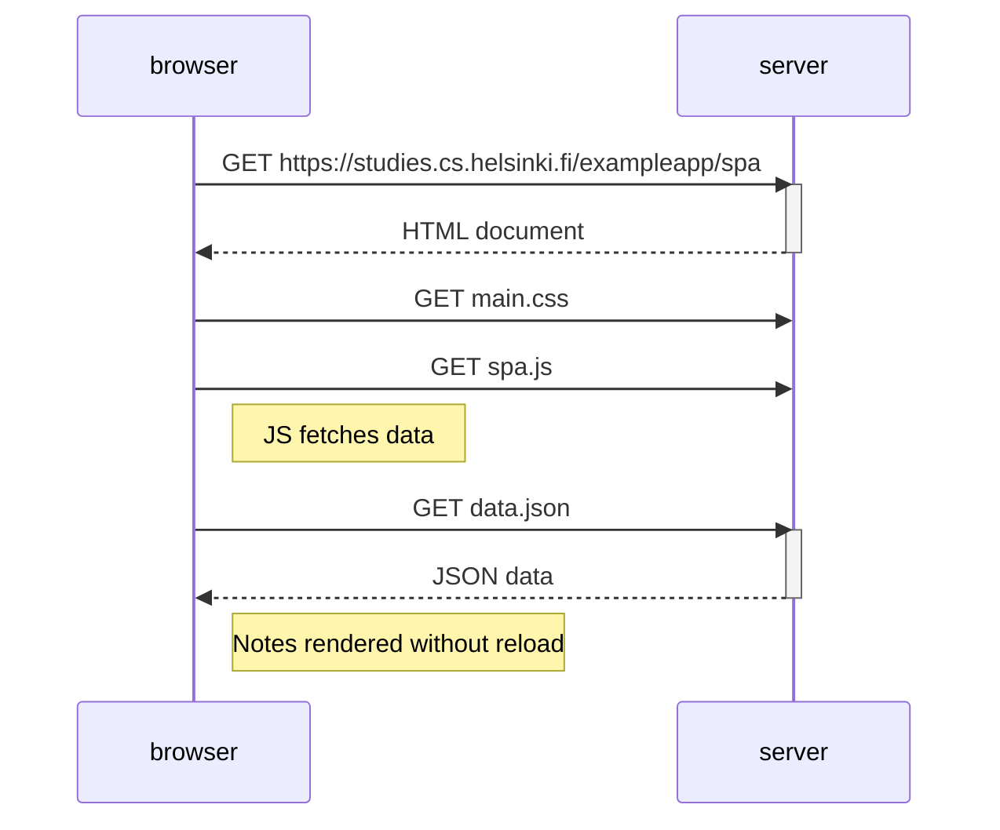
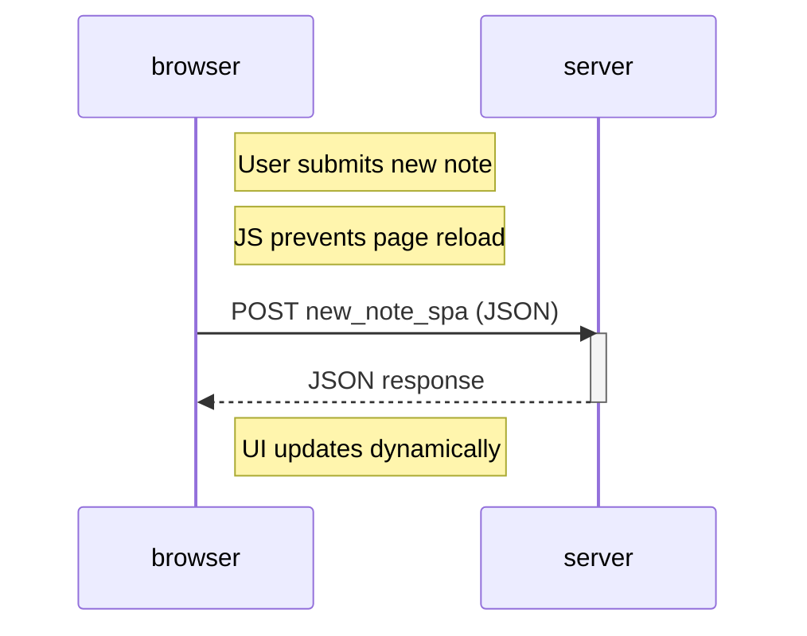

## 0.4: New Note (Traditional Web App)

```mermaid
sequenceDiagram
    participant browser
    participant server

    Note right of browser: User writes a note and clicks Save

    browser->>server: POST https://studies.cs.helsinki.fi/exampleapp/new_note
    activate server
    server-->>browser: HTTP 302 Redirect to /notes
    deactivate server

    browser->>server: GET https://studies.cs.helsinki.fi/exampleapp/notes
    activate server
    server-->>browser: HTML document
    deactivate server

    browser->>server: GET https://studies.cs.helsinki.fi/exampleapp/main.css
    activate server
    server-->>browser: CSS file
    deactivate server

    browser->>server: GET https://studies.cs.helsinki.fi/exampleapp/main.js
    activate server
    server-->>browser: JavaScript file
    deactivate server

    browser->>server: GET https://studies.cs.helsinki.fi/exampleapp/data.json
    activate server
    server-->>browser: updated JSON data
    deactivate server

    Note right of browser: Full page reload happens
```

---

## 0.5: Single Page App

```mermaid
sequenceDiagram
    participant browser
    participant server

    browser->>server: GET https://studies.cs.helsinki.fi/exampleapp/spa
    activate server
    server-->>browser: HTML document
    deactivate server

    browser->>server: GET main.css
    browser->>server: GET spa.js

    Note right of browser: JS fetches data

    browser->>server: GET data.json
    activate server
    server-->>browser: JSON data
    deactivate server

    Note right of browser: Notes rendered without reload
```

---

## 0.6: New Note in SPA

```mermaid
sequenceDiagram
    participant browser
    participant server

    Note right of browser: User submits new note

    Note right of browser: JS prevents page reload

    browser->>server: POST new_note_spa (JSON)
    activate server
    server-->>browser: JSON response
    deactivate server

    Note right of browser: UI updates dynamically
```
